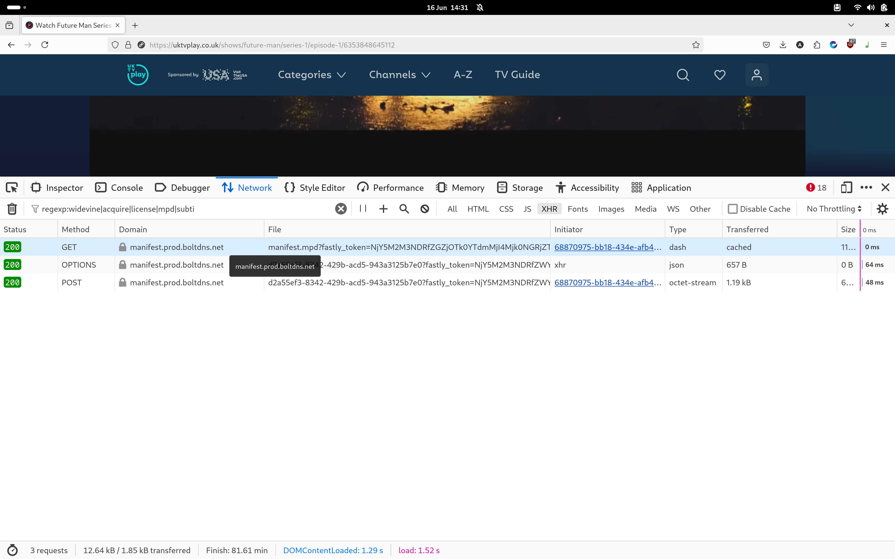
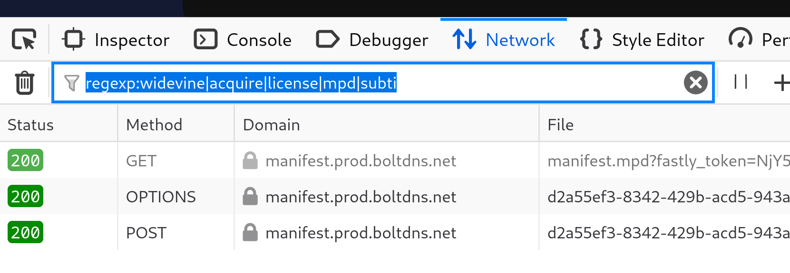
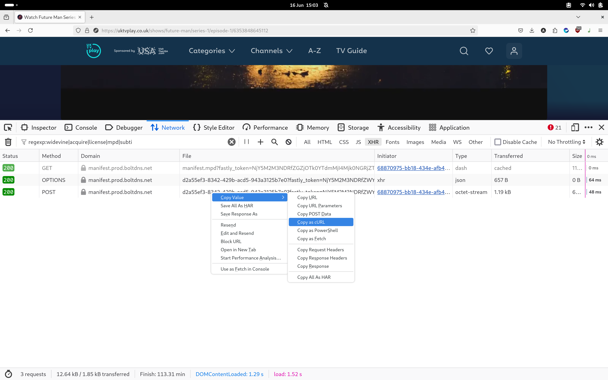
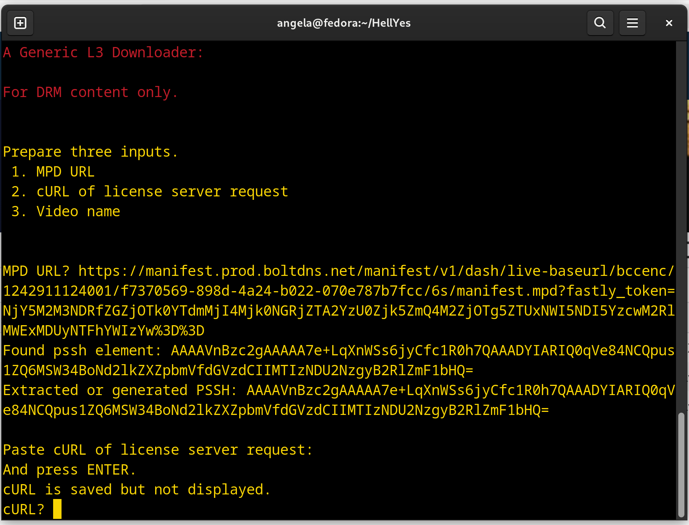

# HellYes

A Widevine Downloader with multi-browser support for Linux and Windows
======================================================================

### Overview

This repo is an adaptation from https://github.com/vinefeeder/HellYes
*All original functions are still available.*
Since the most difficult and boring part of working with these scripts is finding the correct urls to copy, I decided to easy that seek.
Since the sources that we want to use are often behind login walls an yt-dlp command line would be more difficult so I decided to create an extension that will find the correct urls to copy and send them directly to our script

This was original tested on kubuntu but should work in any linux distro.
For installation, you should run 
`./install.sh`
This will
- Install all a python environment for this script
- Check and guide you to install dependencies
- Copy the Native Message in the right places (Native messages is what allow the browser to exchange messages with our script)

After that you can load extensions on your browser.
A pre-compiled version can be found on this repository releases page
If you choose to compile itself be aware that you will need the extension ID for chrome browsers (it is asked on install.sh)

Any contribution towards this repository is appreciated

------ Original README by vinefeeder ------
A generic L3 downloader for DRM content which comes in two versions

*   allhell3.py
*   allhell3gui.py
*   gui.py

Allhell3.py is coded for the all browsers (tested on Chrome, Firefox and Edge) and is supplied very nearly ready to download all media protected by widevine.
You just need to provide a working Content Decryption Module and call it device.wvd and place it in the top level folder of HellYes

gui.py is the latest Graphical User Interface version of allhell3.py. allhell3gui.py is the original gui version.

  
In use, the style of entering data is a little different. allhell3.py uses a paste _without echo to the screen_, and uses Ctrl+D (Linux) or Ctrl+Z (Windows) to signal the end of the cURL input.  
gui.py uses a paste _with echo to the screen_, and uses button clicks to process data.  
Use whichever you like best on your system....  
In both versions a downloader (N\_m3u8DL-RE) or Dash-mpd-cli may be used to download the media. Note that the dash-mpd-cli downloader will download subtitles as a separate file and it will NOT be muxed with the video.

You will need you to download some helper software.

### Pre Use Instructions

Install the following:

*   See the code at [https://github.com/nilaoda/N\_m3u8DL-RE](https://github.com/nilaoda/N_m3u8DL-RE), download the latest release. Unzip and save to a folder named 'binaries'. It can be anywhere on your system. So long as 'binaries' is in your Path.
* s See the code at [https://github.com/emarsden/dash-mpd-cli/releases] for details of dash-mpd-cli downloader.
*   Do the same with [ffmpeg](https://www.videohelp.com/software/ffmpeg) and [MKVToolNix](https://www.videohelp.com/software/MKVToolNix) etc.
*   See [https://www.videohelp.com/software/ffmpeg](https://www.videohelp.com/software/ffmpeg) for more information about ffmpeg.
*   See [https://www.videohelp.com/software/MKVToolNix](https://www.videohelp.com/software/MKVToolNix) for more information about MKVToolNix.
*   See [https://www.bento4.com/downloads/](https://www.bento4.com/downloads/) for more information about Bento4.
*   Since allhell3.py is a python script you also need [python or get it from Microsoft Store if on Windows](https://www.python.org/downloads/)

### How to Use

You provide three bits of information taken from a web page and allhell3.py does the rest.

You start a python script with 'python allhell3.py' written in a terminal or 'python3 gui.py'

But python scripts typically use modules that are imported to the script

Usuallly we use 'pip install module-name' But if the script author has provided a requirements.txt file, then we can use 'pip install -r requirements.txt', so use that here.

If the bare pip install does not work, try 'python3 pip install -r requirements.txt', or failing that 'python -m pip install -r requirements.txt'. Google for 'using pip' if stuck.

On Windows, Microsoft Store has a Terminal App, find an install that to use for running python scripts.  
On Linux You'll already know how to use xterm or whatever

#### You Provide

*   MPD URL
*   cURL of license server request
*   Video name

After you provide the data, it will download the video using N\_m3u8DL-RE or dash-mpd-cli, should you wish, finding keys in the process.

#### You Find

*   MPD URL

Copy and paste the MPD URL from the web page.

For example, open this image in a new tab to see it full size.

The image shows the MPD URL as the first entry. How would we know it was the right one? it has mpd written in it.

How did we open that tool in the browser? Press ctrl+shift+C

How did we hide all the other stuff a web page loads? We used a filter

The filter is a regex or regular expression - it's a way of saying "find all the lines that contain mpd and license"

the regex is "regexp:widevine|acquire|license|mpd" and it means "find all the lines that contain widevine or acquire or license or mpd". However, Chrome does not allow regexp: so use a single word like license or mpd etc.

With expereince you will learn that sites use different words to identify their license url.  
And it the filter does not find it search with method:POST filter. POST messages are sent securely, most http traffic isn't. But licenses are.

*   cURL of license server request

Copy and paste the cURL of the license server request.

For example, open this image in a new tab to see it full size.

Which 'copy as cURL' to use? Windows - choose 'Copy as cURL (Posix)' if available or 'Copy as cURL (bash)'

If using allhell3.py terminate your paste command and tell the script to process the cURL by using Ctrl+Z (Windows) or Ctrl+D (Linux).  
Be prepared for the screen to write several blank lines, shifting existing text upwards rapidly.

*   Video name

Video name is requested once keys are found and the script is ready to download. The name does not need a file type extension added.

#### Allhell3 In action

Running the script.  

Note carefully: allhell3.py.py uses Ctrl + D to enter the cURL on Linux and Ctrl + Z on Windows. Nothing prints to the screen until Ctrl+D or Z is pressed.

#### Allhell gui In action

   

)

#### Coping with 'key too small' errors.

Part of the process of fetching decryption-keys involves the swapping of keys in a Diffie-Helman type process, to validate the authority of a user. Some servers with old hardware use keys that are small enough to crack by brute force. So most systems force the use of larger, more secure, keys.  
The system will then reject the connection and complain 'keys are too small'. If that happens use the included script allhell3gui\_lowerDH.py which attempts to force the system to accept smaller keys.

Happy allhell3.py!  
 
A\_n\_g\_e\_l\_a
